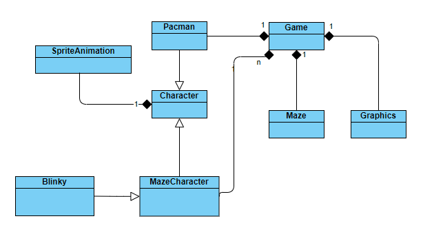

# Pacman
This game is the capstone project for [Udacity C++ Nanodegree Program](https://www.udacity.com/course/c-plus-plus-nanodegree--nd213)

## Dependencies for Running Locally
* cmake >= 3.12
  * All OSes: [click here for installation instructions](https://cmake.org/install/)
* make >= 4.1 (Linux, Mac), 3.81 (Windows)
  * Linux: make is installed by default on most Linux distros
  * Mac: [install Xcode command line tools to get make](https://developer.apple.com/xcode/features/)
  * Windows: [Click here for installation instructions](http://gnuwin32.sourceforge.net/packages/make.htm)
* SDL2 >= 2.0
  * All installation instructions can be found [here](https://wiki.libsdl.org/Installation)
  * Note that for Linux, an `apt` or `apt-get` installation is preferred to building from source.
* SDL2-image-dev >= 2.0
  * All installation instructions can be found [here](https://www.libsdl.org/projects/SDL_image/)
  * Note that for Linux, an `apt` or `apt-get` installation is preferred to building from source.
* libpng(for reading png files) >= 1.6
  * All installation instructions can be found [here](http://www.libpng.org/pub/png/libpng.html)
  * Note that for Linux, an `apt` or `apt-get` installation is preferred to building from source.
* gcc/g++ >= 5.4
  * Linux: gcc / g++ is installed by default on most Linux distros
  * Mac: same deal as make - [install Xcode command line tools](https://developer.apple.com/xcode/features/)
  * Windows: recommend using [MinGW](http://www.mingw.org/)

## Basic Build Instructions

1. Clone this repo.
2. Make a build directory in the top level directory: `mkdir build && cd build`
3. Copy the assets and img folders to build directory
4. CMake: `cmake ../ `
5. Compile: `make`
6. Run it: `./Pacman`.

## Description

This project is just a part of the Pacman game, the data is loaded from the assets files. The hero (Pacman) go throught the map eating the points that there are in the Map,
meanwhile a ghost (Blinky) is trying to capture. However, if a special food is eaten, then the ghost is vulnerable and he can be capture for Pacman as a consequence, the ghost will return to the start point.

## Classes

* ***Game(Game.h)***: This class is in charge of managing the loop game (e.g. get input, update and draw the elements, collisions between elements and finish the game).
* ***Maze(Maze.h)***: This class is in charge of manage all the elements on the map (Blocks, Spaces, Food, Fruits).
* ***Graphics(Graphics.h)***: This class is in charge of managing the SDL2 graphic window system 
* ***SpriteAnimation(SpriteAnimation.h)***: A container for a sprite sheet image and the frames for every animation. 
* ***Character(Character.h)***: An abstract class, which is initialized by reading a file, in which is stored information about the speed, the image for showing and the animations (name of animations, number of frames per animation, and the coordinates for every frame).  This class handles and shows the animations. Every animation is drawn as a cyclic animation. Moreover, it has interface methods for updating the character's position.
* ***Pacman(Pacman.h)***: Class for the hero in this game and is an implementation of the Character class. This class update the position depending on the input of the user. If the hero reaches a wall, it will stop until the user press a valid key.
*MazeCharacter(MazeCharacter.h): Abstract class for the enemy character, also this is a Character implementation. This class is in charge of moving the enemy over the map based on the current direction. This class provides a pure virtual method for updating the current direction.
* ***Blinky(Blinky.h)***: An MazeCharacter implementation. He tries to reduce the distance between the hero and himself.
* ***Namespace PacmanUtils(Utils.h)***: Here, there are the definitions of the constants strings for reading the files, the enum for the type of items in the map, the enum for character states, auxiliary methods for these enums (convert from strings to enum or from enum to string) and finally a collision method for two surfaces.

